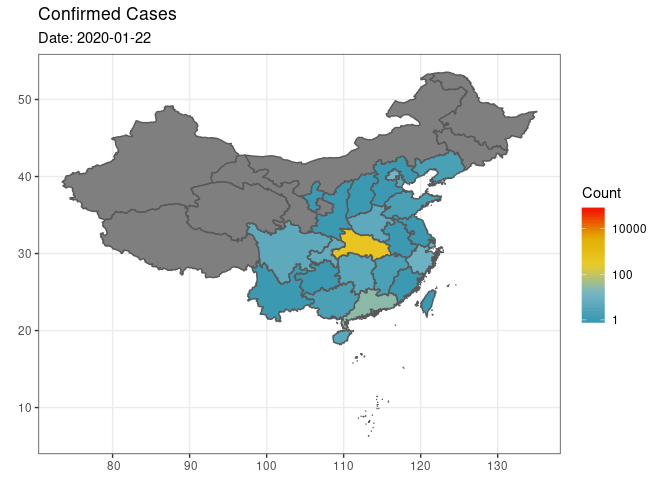

```{r setup, include=FALSE}
knitr::opts_chunk$set(echo = TRUE, cache = TRUE)
```

## Task

1. Develop a Shiny app that visualizes the progression of the 2019-20 Global Coronavirus Outbreak. 

2. If you are ambitious, bring in visualization of other types of data, e.g., stock market, tweets, contrast with previous outbreak (e.g., 2003 SARS, 2009 H1N1, 2012 MERS, 2014 Ebola), prediction from your statistical/epidemiological model, and so on. 

3. Publish your Shiny app to <https://www.shinyapps.io> and share the link.

4. (Optinal) Submit your app to the 2020 Shiny Contest (deadline 20 March 2020 at 5pm ET). 

Below is some data exploration, which may help you get started. You do _not_ have to use it. Note below code may change frequently.

<!-- Johns Hopkins CSSE Visualization: <https://gisanddata.maps.arcgis.com/apps/opsdashboard/index.html#/bda7594740fd40299423467b48e9ecf6> -->

<!-- Downloadable Google sheet: -->
<!-- <https://docs.google.com/spreadsheets/d/1wQVypefm946ch4XDp37uZ-wartW4V7ILdg-qYiDXUHM/edit#gid=787605648> -->

<!-- Time series table: <https://docs.google.com/spreadsheets/d/1UF2pSkFTURko2OvfHWWlFpDFAr1UxCBA4JLwlSP6KFo/edit#gid=0> -->

```{r include=FALSE}
library(tidyverse)
library(lubridate)
library(fs)
```

## Import JHU Google Sheets into R - **EXPIRED on Feb 11**

**Since Feb 11, JHU CSSE stops posting data on Google Sheets.**

Johns Hopkins University (JHU) Center for Systems Science and Engineering (CSSE) kindly compiles, updates, and shares the current data on 2019-nCoV outbreak at Google Sheets: <https://docs.google.com/spreadsheets/d/1UF2pSkFTURko2OvfHWWlFpDFAr1UxCBA4JLwlSP6KFo>.

We can use the tidyverse package [`googlesheets4`](https://googlesheets4.tidyverse.org) to import data from Google Sheets. Because the JHU sheets are public, we don't need authentication by tokens.
```{r, eval = FALSE}
library(googlesheets4)
# no authentication
sheets_deauth()
```
Import the `confirmed` sheet:
```{r, eval = FALSE}
(confirmed <- 
   read_sheet("1UF2pSkFTURko2OvfHWWlFpDFAr1UxCBA4JLwlSP6KFo", sheet = 2))
```
Import the `recovered` sheet:
```{r, eval = FALSE}
(recovered <- 
   read_sheet("1UF2pSkFTURko2OvfHWWlFpDFAr1UxCBA4JLwlSP6KFo", sheet = 3))
```
Import the `death` sheet:
```{r, eval = FALSE}
(death <- 
   read_sheet("1UF2pSkFTURko2OvfHWWlFpDFAr1UxCBA4JLwlSP6KFo", sheet = 4))
```

## Import JHU SSE data on GitHub into R

Since Feb 11, JHU SSE is hosting 2019 nCoV data on GitHub repo: <https://github.com/CSSEGISandData/2019-nCoV>.

Let's import the time series data directly from the csv file on GitHub:
```{r}
(confirmed <- read_csv("https://raw.githubusercontent.com/CSSEGISandData/COVID-19/master/csse_covid_19_data/csse_covid_19_time_series/time_series_19-covid-Confirmed.csv"))
(recovered <- read_csv("https://raw.githubusercontent.com/CSSEGISandData/COVID-19/master/csse_covid_19_data/csse_covid_19_time_series/time_series_19-covid-Recovered.csv"))
(death <- read_csv("https://raw.githubusercontent.com/CSSEGISandData/COVID-19/master/csse_covid_19_data/csse_covid_19_time_series/time_series_19-covid-Deaths.csv"))
```

## Tidy data

I want to tidy data into the long format. `pivot_longer` is the modern version of `gather` function in dplyr.
```{r}
confirmed_long <- confirmed %>%
  pivot_longer(-(`Province/State`:Long), 
               names_to = "Date", 
               values_to = "confirmed") %>%
  mutate(Date = (mdy(Date))) # convert string to date-time
confirmed_long
```
```{r}
recovered_long <- recovered %>%
  pivot_longer(-(`Province/State`:Long), 
               names_to = "Date", 
               values_to = "recovered") %>%
  mutate(Date = mdy(Date))
recovered_long
```
```{r}
death_long <- death %>%
  pivot_longer(-(`Province/State`:Long), 
               names_to = "Date", 
               values_to = "death") %>%
  mutate(Date = mdy(Date))
death_long
```

```{r}
ncov_tbl <- confirmed_long %>%
  left_join(recovered_long) %>%
  left_join(death_long) %>%
  pivot_longer(confirmed:death, 
               names_to = "Case", 
               values_to = "Count")
ncov_tbl %>% print(width = Inf)
```

## Other data sources

Other sources of data:  
- Tencent (in Chinese): <https://news.qq.com/zt2020/page/feiyan.htm>  
- R package `nCov2019`; install by `remotes::install_github("GuangchuangYu/nCov2019")`   
- Shiny app [`coronavirus`](https://github.com/JohnCoene/coronavirus)   

## Mapping China provinces

Some useful resources for mapping:  
- The book [_Geocomputation with R_](https://geocompr.robinlovelace.net). Especially [Chapter 8 Making Maps with R](https://geocompr.robinlovelace.net/adv-map.html).  
- The book [_An Introduction to Spatial Analysis and Mapping in R_](https://bookdown.org/lexcomber/brunsdoncomber2e/). 

### Use mapdata - **MAP IS TOO OLD**

The package `mapdata` contains a data `china`. But the map seems out-dated. For example, Chongqing is sill a part of Sichuan province in this map.
```{r}
suppressMessages(library(mapdata))
map("china", col = "gray40", ylim = c(18,54))
```

### Use GADM data - **THIS IS VERY SLOW**

Download GADM data for China at <https://www.gadm.org/download_country_v3.html>. There are 4 levels of details to plot. We opt for the level 1 which is at the province level.
```{r, eval = FALSE}
library(sf)
library(tidyverse)
gadm36_CHN_1_sf <- readRDS("gadm36_CHN_0_sf.rds")
ggplot(data = gadm36_CHN_1_sf) + 
  geom_sf()
```

```{r, eval = FALSE}
library("GADMTools")
map <- gadm_sp_loadCountries("CHN", level = 1, basefile = "./")
gadm_plot(map) + theme_light()
```

### Use shapefile from GADM - **THIS IS VERY SLOW**

```{r, eval = FALSE}
library(maptools)
map <- rgdal::readOGR("gadm36_CHN_shp/gadm36_CHN_1.shp")
plot(map)
```

### Use GIS data from China

A self note about installing `sf` package on CentOS 7: <https://gist.github.com/Hua-Zhou/6c11babe35437ce1ea8e4893a14d07c8>.

Donwload China GIS data from [here](https://uploads.cosx.org/2009/07/chinaprovinceborderdata_tar_gz.zip), unzip, and put in the working directory.
```{bash}
ls -l bou2_4p.*
```
Read in the shape file into simple feature (SF) format. Replace the `NA` in `NAME` by Macau.
```{r}
library(sf)
chn_map <- st_read("./bou2_4p.shp", as_tibble = TRUE) %>%
  mutate(NAME = iconv(NAME, from = "GBK"),
         BOU2_4M_ = as.integer(BOU2_4M_),
         BOU2_4M_ID = as.integer(BOU2_4M_ID)) %>%
  mutate(NAME = str_replace_na(NAME, replacement = "澳门特别行政区")) %>%
  print()
```
There are about 34 provinces in China, why there are 925 areas?
```{r}
chn_map %>% 
  count(NAME) %>% 
  print(n = Inf)
```


`ggplot2` can plot SF data using `geom_sf` function:
```{r}
chn_map %>%
  ggplot() + 
  geom_sf(mapping = aes(geometry = geometry), color = "black", fill = "white") + 
  #geom_sf_label(mapping = aes(label = NAME)) + 
  theme_bw() # better for maps 
```
These are the provinces available from the JHU sheets.
```{r}
ncov_tbl %>%
  filter(`Country/Region` %in% c("Mainland China", "Macau", "Hong Kong", "Taiwan")) %>%
  distinct(`Province/State`, `Country/Region`) %>%
  print(n = Inf)
```
In order to join the tibbles `ncov_tbl` and `chn_map`, we need to use the province name as key. Let's create a function to translate Chinese province name to English.
```{r}
translate <- function(x) {
  sapply(x, function(chn_name) {
    if (str_detect(chn_name, "澳门")) {
      eng_name <- "Macau"
    } else if (str_detect(chn_name, "台湾")) {
      eng_name <- "Taiwan"
    } else if (str_detect(chn_name, "上海")) {
      eng_name <- "Shanghai"
    } else if (str_detect(chn_name, "云南")) {
      eng_name <- "Yunnan"
    } else if (str_detect(chn_name, "内蒙古")) {
      eng_name <- "Inner Mongolia"
    } else if (str_detect(chn_name, "北京")) {
      eng_name <- "Beijing"
    } else if (str_detect(chn_name, "台湾")) {
      eng_name <- "Taiwan"
    } else if (str_detect(chn_name, "吉林")) {
      eng_name <- "Jilin"
    } else if (str_detect(chn_name, "四川")) {
      eng_name <- "Sichuan"
    } else if (str_detect(chn_name, "天津")) {
      eng_name <- "Tianjin"
    } else if (str_detect(chn_name, "宁夏")) {
      eng_name <- "Ningxia"
    } else if (str_detect(chn_name, "安徽")) {
      eng_name <- "Anhui"
    } else if (str_detect(chn_name, "山东")) {
      eng_name <- "Shandong"
    } else if (str_detect(chn_name, "山西")) {
      eng_name <- "Shanxi"
    } else if (str_detect(chn_name, "广东")) {
      eng_name <- "Guangdong"
    } else if (str_detect(chn_name, "广西")) {
      eng_name <- "Guangxi"
    } else if (str_detect(chn_name, "新疆")) {
      eng_name <- "Xinjiang"
    } else if (str_detect(chn_name, "江苏")) {
      eng_name <- "Jiangsu"
    } else if (str_detect(chn_name, "江西")) {
      eng_name <- "Jiangxi"
    } else if (str_detect(chn_name, "河北")) {
      eng_name <- "Hebei"
    } else if (str_detect(chn_name, "河南")) {
      eng_name <- "Henan"
    } else if (str_detect(chn_name, "浙江")) {
      eng_name <- "Zhejiang"
    } else if (str_detect(chn_name, "海南")) {
      eng_name <- "Hainan"
    } else if (str_detect(chn_name, "湖北")) {
      eng_name <- "Hubei"
    } else if (str_detect(chn_name, "湖南")) {
      eng_name <- "Hunan"
    } else if (str_detect(chn_name, "甘肃")) {
      eng_name <- "Gansu"
    } else if (str_detect(chn_name, "福建")) {
      eng_name <- "Fujian"
    } else if (str_detect(chn_name, "西藏")) {
      eng_name <- "Tibet"
    } else if (str_detect(chn_name, "贵州")) {
      eng_name <- "Guizhou"
    } else if (str_detect(chn_name, "辽宁")) {
      eng_name <- "Liaoning"
    } else if (str_detect(chn_name, "重庆")) {
      eng_name <- "Chongqing"
    } else if (str_detect(chn_name, "陕西")) {
      eng_name <- "Shanxi"
    } else if (str_detect(chn_name, "青海")) {
      eng_name <- "Qinghai"
    } else if (str_detect(chn_name, "香港")) {
      eng_name <- "Hong Kong"
    } else if (str_detect(chn_name, "黑龙江")) {
      eng_name <- "Heilongjiang"
    } else {
      eng_name <- chn_name # don't translate if no correspondence
    }
    return(eng_name)
  })
}
```
Create a new variable `NAME_ENG`:
```{r}
chn_prov <- chn_map %>% 
  count(NAME) %>%
  mutate(NAME_ENG = translate(NAME)) # translate function is vectorized
chn_prov %>% print(n = Inf)
```

## Plotting 2019-nCoV incidence

Try to join the virus data `ncov_tbl` and map data `chn_prov`.
```{r}
# for exploration
plotdate <- "2020-02-14"
case <- "confirmed"
ncov_tbl %>%
  filter(`Country/Region` %in% c("Mainland China", "Macau", "Hong Kong", "Taiwan")) %>%
  filter(Date == plotdate, Case == case) %>%
  group_by(`Province/State`) %>%  
  top_n(1, Date) %>%
  right_join(chn_prov, by = c("Province/State" = "NAME_ENG")) # join map and virus data
```

Plot confirmed cases on a specific date:
```{r}
library(wesanderson)

plotdate <- "2020-02-14"
case <- "confirmed"

ncov_tbl %>%
  filter(`Country/Region` %in% c("Mainland China", "Macau", "Hong Kong", "Taiwan")) %>%
  filter(Date == plotdate, Case == case) %>%
  group_by(`Province/State`) %>%  
  top_n(1, Date) %>% # take the latest count on that date
  right_join(chn_prov, by = c("Province/State" = "NAME_ENG")) %>%
  ggplot() +
  geom_sf(mapping = aes(fill = Count, geometry = geometry)) +
  # scale_fill_gradient(low = "white",
  #                     high = "red",
  #                     trans = "log10",
  #                     limits = c(1, 50000),
  #                     breaks = c(1, 10, 100, 1000, 10000),
  #                     name = "") +
  scale_fill_gradientn(colors = wes_palette("Zissou1", 100, type = "continuous"),
                       trans = "log10") + # can we find a better palette?
  # #scale_fill_brewer(palette = "Dark2") + 
  theme_bw() +
  labs(title = str_c(case, " cases"), subtitle = plotdate)
```


To plot the line graph of confirmed cases over time. You can do an animization of this over time.
```{r}
ncov_tbl %>%
  filter(`Country/Region` %in% c("Mainland China", "Macau", "Hong Kong", "Taiwan")) %>%
  group_by(Date, Case) %>%  
  summarise(total_count = sum(Count)) %>%
  # print()
  ggplot() +
  geom_line(mapping = aes(x = Date, y = total_count, color = Case), size = 2) + 
  scale_color_manual(values = c("blue", "black", "green")) + 
  scale_y_log10() + 
  labs(y = "Count") + 
  theme_bw()
```

Counts by province on a specific date. Do an animation on date.
```{r}
date <- "2020-02-18"
ncov_tbl %>%
  filter(`Country/Region` %in% c("Mainland China", "Macau", "Hong Kong", "Taiwan"), 
         `Date` == date) %>%
  group_by(`Province/State`) %>%
  ggplot() +
  geom_col(mapping = aes(x = `Province/State`, y = `Count`, fill = `Case`)) + 
  scale_y_log10() +
  labs(title = date) + 
  theme(axis.text.x = element_text(angle = 90))
```

## Animation

Resources about making animations in R:  
- [gganimate](https://gganimate.com/index.html) package.  
- Section 8.3 of [Geomcomputation with R](https://geocompr.robinlovelace.net/adv-map.html#animated-maps). 

```{r}
ncov_tbl %>%
  filter(`Country/Region` %in% c("Mainland China", "Macau", "Hong Kong", "Taiwan")) %>%
  filter(Case == case) %>%
  right_join(chn_prov, by = c("Province/State" = "NAME_ENG")) %>%
  print()
```

Plot the date at all time points (this takes long, a couple minutes):
```{r, eval = !file.exists("confirmed_anim.gif") | (file_info("confirmed_anim.gif") %>% pull(modification_time) %>% date() < today())}
library(gganimate)
library(transformr)

case = "confirmed"

(p <- ncov_tbl %>%  
  filter(`Country/Region` %in% c("Mainland China", "Macau", "Hong Kong", "Taiwan")) %>%
  filter(Case == case) %>%
  right_join(chn_prov, by = c("Province/State" = "NAME_ENG")) %>%
  ggplot() + 
  geom_sf(mapping = aes(fill = Count, geometry = geometry)) + 
  # scale_fill_gradient(low = "white",
  #                     high = "red",
  #                     trans = "log10",
  #                     limits = c(1, 100000),
  #                     breaks = c(1, 10, 100, 1000, 10000),
  #                     name = "") +
  scale_fill_gradientn(colours = wes_palette("Zissou1", 100, type = "continuous"),
                       trans = "log10") + 
  theme_bw() +
  labs(title = str_c(case, " cases")))
```
Make animation and save as gif (this takes long, a couple minutes)
```{r, eval = !file_exists("confirmed_anim.gif") | (file_info("confirmed_anim.gif") %>% pull(modification_time) %>% date() < today())}
(anim <- p + 
  transition_time(Date) + 
  labs(title = "Confirmed Cases", subtitle = "Date: {frame_time}"))
animate(anim, renderer = gifski_renderer())
anim_save("confirmed_anim.gif")
```
<p align="center">
  
</p>

## Impact on economy

```{r}
library(quantmod)
stock <- getSymbols("^HSI", # S&P 500 (^GSPC), Dow Jones (^DJI), NASDAQ (^IXIC), Russell 2000 (^RUT), FTSE 100 (^FTSE), Nikkei 225 (^N225), HANG SENG INDEX (^HSI)
                    src = "yahoo", 
                    auto.assign = FALSE, 
                    from = min(ncov_tbl$Date),
                    to = max(ncov_tbl$Date)) %>% 
  as_tibble(rownames = "Date") %>%
  mutate(Date = date(Date)) %>%
  ggplot() + 
  geom_line(mapping = aes(x = Date, y = HSI.Adjusted)) +
  theme_bw()
stock
# chartSeries(stock, theme = chartTheme("white"),
#            type = "line", log.scale = FALSE, TA = NULL)
```

## Mapping countries

TODO
