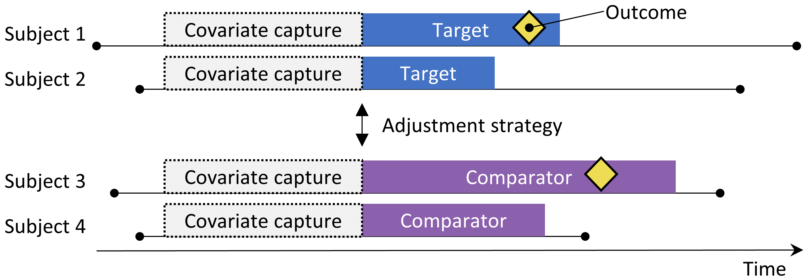

```{r setup, include=FALSE}
knitr::opts_chunk$set(echo = TRUE)
library(dplyr)
library(kableExtra)
```

## Acknowledgement

- ***The Book of OHDSI***: <https://ohdsi.github.io/TheBookOfOhdsi/>

- ***Secondary Analysis of Electronic Health Records*** <https://link.springer.com/book/10.1007/978-3-319-43742-2>

- Lecture notes by [Dr. Jin Zhou](https://publichealth.arizona.edu/directory/jin-zhou) @ University of Arizona.

# Case examples 
 - IBM Waston Healthcare: [Predictive Analytics in Value-Based Healthcare: Forecasting Risk, Utilization, and Outcomes](https://www.ibm.com/downloads/cas/OL8QVKN7)
 - Google Health: [How AI can help health](https://www.youtube.com/watch?v=JzB7yS9t1YE)
 - [Deep Learning for Electronic Health Records](https://ai.googleblog.com/2018/05/deep-learning-for-electronic-health.html)
 - [Predicting lung cancer](https://www.nature.com/articles/s41591-019-0447-x)
 - [Uncovering cost savings hidden in administrative and operational data](https://www.ibm.com/blogs/watson-health/uncovering-cost-savings-hidden-administrative-operational-data/)
 - [Truven Health Analytics owns many well-known brands in healthcare, such as IBM MarketScan®, 100 Top Hospitals®, IBM Advantage Suite®, IBM Micromedex®, Simpler® and IBM ActionOI®.](https://www.ibm.com/watson-health/learn/truven-health-analytics)


&nbsp;
&nbsp;
<p align="center">

</p>
&nbsp;
&nbsp;

1.   Predictive Modelling: Predictive Modeling is about using historical data to view the model for predicting future outcome. It is not a single algorithm, but rather a sequence of computational tasks. The key steps are:
      + defining the prediction target, constructing the right patient cohort, and constructing the right features (observation window, index date, prediction window and diagnosis date);
      + models to predict outcome.
<p align="center">

</p>
The model can be a classification problem (predicting if the patient will have a heart failure or not) or a regression problem (predicting costs a patient will incur). 
The final step of this pipeline is to asses how good our model is through performance evaluation (Leave-one-out cross validation, K-fold cross validation, randomized cross validation).
&nbsp;
&nbsp;

2. Computational Phenotyping, Computational Phenotyping is about turning messy Electronic Health Records (EHRs) into meaningful clinical concepts. 
<p align="center">

</p>
&nbsp;
The input to computational phenotyping is raw patient data from many sources such as demographic information diagnosis, medication, procedure, lab test and clinical notes. The phenotyping algorithm converts this raw patient data into medical concepts or phenotypes. The main usage of this data is to support clinical operations such as billing, or to support genomic studies.

    + Medical Oncology. One of the things that makes Healthcare a unique domain for Big Data Analytics is the existence of structured medical knowledge. Current effor: OMOP common data model <https://www.ohdsi.org/data-standardization/>
&nbsp;
<p align="center">

</p>
&nbsp;
    + The most popular medical ontology is called SNOMED (Systemized Nomenclature of Medicine). It is a huge graph medical concepts and their relations with each other.
        + The patient is coming to a hospital to get a lab test. The result of this lab test is stored using a LOINC code.
        + The lab test result goes to the doctor who diagnoses the patient with different ICD codes.
        + Once we have the diagnosis on this patient, we want to treat him with a medical procedure represented by a CPT code.
        + The patient can also take some medication that is represented by an NDC code.
    +  A Tensor for EHR. Here, $\lambda$ captures the importance of each Phenotype after Tensor Factorisation.
&nbsp;
<p align="center">

</p>
&nbsp;

3. Patient Similarity. In Healthcare, the traditional paradigm has been evidence-based medicine in which decisions are based on well-designed and conducted research and then applying those guidelines in practice through Randomized Clinical Trails (RCT). The problem with RCT is that it requires a controlled environment as well as population. And it tests one thing at a time which is expensive and time consuming. Patient Similarity algorithms use healthcare data to identify groups of patients sharing similar characteristics. Patient Similarity can potentially give rise to a new paradigm called Precision Medicine, where personalized decision making is recommended after conducting Pragmatic Trials (PT) based on EHR data and measuring similarity among patients.
&nbsp;
<p align="center">

</p>
&nbsp;

    + [Real world evidence](https://www.fda.gov/science-research/science-and-research-special-topics/real-world-evidence), [guideline](https://www.fda.gov/regulatory-information/search-fda-guidance-documents/submitting-documents-using-real-world-data-and-real-world-evidence-fda-drugs-and-biologics-guidance) from FDA when submitting drugs, devices, etc. Example, a paper published in [Lancet](https://www.thelancet.com/journals/lancet/article/PIIS0140-6736(19)32317-7/fulltext) very recently.
<p align="center">

</p>
&nbsp;

# Population-Level Estimation
  - Population-level effect estimation refers to the estimation of **average causal effects** of exposures (e.g. medical interventions such as drug exposures or procedures) on specific health outcomes of interest. 
  
  - Direct effect estimation: estimating the effect of an exposure on the risk of an outcome, as compared to no exposure.
  
  - Comparative effect estimation: estimating the effect of an exposure (the target exposure) on the risk of an outcome, as compared to another exposure (the comparator exposure).
  
  - In both cases, the patient-level causal effect contrasts a **factual outcome**, i.e., what happened to the exposed patient, with a **counterfactual** outcome, i.e., what would have happened had the exposure not occurred (direct) or had a different exposure occurred (comparative). 

  - Since any one patient reveals only the factual outcome (the fundamental problem of causal inference), the various effect estimation designs employ different analytic devices to shed light on the counterfactual outcomes.
  
  - In the causal inference lanuage:  
      +  We observe $N$ units, indexed by $i = 1,...,N$, drawn randomly from a large population. For each unit, there is a pair of potential outcomes, $Y_i(0)$ for the outcome under the control treatment and $Y_i(1)$ for the outcome under the active treatment. In addition, each unit has a vector of covariates and denoted by $X_i$. 
      +  Each unit is exposed to a single treatment: $W_i = 0$ if unit $i$ receives the control treatment and $W_i = 1$ if unit $i$ receives the active treatment. We therefore observe for each unit the triple $(W_i, Y_i, X_i)$, where $Y_i$ is the realized outcome:
      $$Y_i \equiv  Y_i(W_i) = \begin{pmatrix}Y_i(0) & \mbox{if $W_i=0$}\\
          Y_i(1) & \mbox{if $W_i=1$}
        \end{pmatrix}$$
      + Population average treatment effect:
      $$\tau_P = E[Y_i(1)−Y_i(0)]$$
      + Sample average treatment effect :
      $$\tau_s = \frac{1}{N}\sum_{i=1}^N \left( Y_i(1)−Y_i(0)\right)$$

      + **Assumption 1 (strongly ignorable)** $$\left\{ Y_i(0), Y_i(1)\right\} \perp W_i \mid X_i $$
      + **Assumption 2 (overlap) ** 
                        $$0 < Pr(W_i=1|X_i) < 1$$
      + If the two assumption holds, we can estimate average treatment effect $\tau$ as
      $$
      \begin{align}
      \tau(x) &\equiv E[Y_i(1) - Y_i(0)|X_i = x]\\
          & = E[Y_i(1)|X_i = x] - E[Y_i(0)|X_i = x]\\
             & =  E[Y_i(1)|X_i = x, W_i=1] - E[Y_i(0)|X_i = x, W_i=0]\\
       & =  E[Y_i|X_i = x, W_i=1] - E[Y_i|X_i = x, W_i=0]
       \end{align}
      $$

## Study designs

### The Cohort Method Design
<center>
<div class="figure">

<p class="caption">The new-user cohort design.</p>
</div>
</center>

The cohort method attempts to emulate a randomized clinical trial. Subjects that are observed to initiate one treatment (the target) are compared to subjects initiating another treatment (the comparator) and are followed for a specific amount of time following treatment initiation, for example the time they stay on the treatment. 

|Choice                  |                                                                                                                 Description |
-------------------------|-----------------------------------------------------------------------------------------------------------------------------|
|Target cohort	         | 	    	    	    	    	    	    	    	    	    	    	    	    	         A cohort representing the target treatment|
|Comparator cohort	     | 	    	    	    	    	    	    	    	    	    	                       A cohort representing the comparator treatment|
|Outcome cohort	         |  	    	    	    	    	    	    	    	    	    	                      A cohort representing the outcome of interest|
|Time-at-risk	           |At what time (often relative to the target and comparator cohort start and end dates) do we consider the risk of the outcome?|
|Model	                 |                      The model used to estimate the effect while adjusting for differences between the target and comparator|


<!--The choice of model specifies, among others, the type of outcome model. For example, we could use a logistic regression, which evaluates whether or not the outcome has occurred, and produces an odds ratio. A logistic regression assumes the time-at-risk is of the same length for both target and comparator, or is irrelevant. Alternatively, we could choose a Poisson regression which estimates the incidence rate ratio, assuming a constant incidence rate. Often a Cox regression is used which considers time to first outcome to estimate the hazard ratio, assuming proportional hazards between target and comparator. -->
-  The new-user cohort method inherently is a method for comparative effect estimation, comparing one treatment to another. It is difficult to use this method to compare a treatment against no treatment, since it is hard to define a group of unexposed people that is comparable with the exposed group. 
-  If one wants to use this design for direct effect estimation, the preferred way is to select a comparator treatment for the same indication as the exposure of interest, where the comparator treatment is believed to have no effect on the outcome. 
-  A **key concern** is that the patients receiving the target treatment may systematically differ from those receiving the comparator treatment. 
-  One mechanism to deal with confounders in observational studies is through **propensity scores**.

&nbsp;
<!--For example, suppose the target cohort is on average 60 years old, whereas the comparator cohort is on average 40 years old. Comparing target to comparator with respect to any age-related health outcome (e.g. stroke) might then show substantial differences between the cohorts. An uninformed investigator might reach the conclusion there is a causal association between the target treatment and stroke as compared to the comparator. More prosaically or commonplace, the investigator might conclude that there exist target patients that experienced stroke that would not have done so had they received the comparator. This conclusion could well be entirely incorrect! Maybe those target patients disproportionately experienced stroke simply because they are older; maybe the target patients that experienced stroke might well have done so even if they had received the comparator. In this context, age is a “confounder.”-->

#### Propensity Score 

- For a given patient, the propensity score (PS) is the probability that that patient received the target treatment as against the comparator. 
- In a balanced two-arm randomized trial, the propensity score is 0.5 for every patient. 
- In a propensity score-adjusted observational study, we estimate the probability of a patient receiving the target treatment based on what we can observe in the data on and before the time of treatment initiation (irrespective of the treatment they actually received), e.g. a logistic regression. 
- The PS can be used in several ways: 
    + matching target subjects to comparator subjects with similar PS
    + stratifying the study population based on the PS
    + weighting subjects using Inverse Probability of Treatment Weighting (IPTW) derived from the PS. 
    
- Propensity scoring controls for measured confounders. If treatment assignment is “strongly ignorable” given measured characteristics, propensity scoring will yield an unbiased estimate of the causal effect. 
- “Strongly ignorable” essentially means that there are no unmeasured confounders, and that the measured confounders are adjusted for appropriately. Unfortunately this is not a testable assumption. 

<!--For example, suppose we use one-on-one PS matching, and that Jan has a priori probability of 0.4 of receiving the target treatment and in fact receives the target treatment. If we can find a patient (named Jun) that also had an a priori probability of 0.4 of receiving the target treatment but in fact received the comparator, the comparison of Jan and Jun’s outcomes is like a mini-randomized trial, at least with respect to measured confounders. This comparison will yield an estimate of the Jan-Jun causal contrast that is as good as the one randomization would have produced. Estimation then proceeds as follows: for every patient that received the target, find one or more matched patients that received the comparator but had the same prior probability of receiving the target. Compare the outcome for the target patient with the outcomes for the comparator patients within each of these matched groups.-->
<center>
<div class="figure">


<p class="caption"></p>
</div>
</center>

### The Self-Controlled Cohort Design
<center>
<div class="figure">

<p class="caption">The self-controlled cohort design. The rate of outcomes during exposure to the target is compared to the rate of outcomes in the time pre-exposure.</p>
</div>
</center>


The self-controlled cohort (SCC) design [Ryan, Schuemie, and Madigan 2013](https://www.ncbi.nlm.nih.gov/pubmed/24166227) compares the rate of outcomes during exposure to the rate of outcomes in the time just prior to the exposure. 

|Choice                  |                                                                                                                 Description |
-------------------------|-----------------------------------------------------------------------------------------------------------------------------|
|Target cohort	         |                                                                                         A cohort representing the treatment |
|Outcome cohort	         |                                                                                A cohort representing the outcome of interest|
|Time-at-risk	           |              At what time (often relative to the target cohort start and end dates) do we consider the risk of the outcome? |
|Control time	           |                                                                                     The time period used as the control time|


- Because the same subject that make up the exposed group are also used as the control group, no adjustment for between-person differences need to be made. 
- However, the method is vulnerable to other differences, such as differences in the baseline risk of the outcome between different time periods.
&nbsp;

### The Case-Control Design
<center>
<div class="figure">

<p class="caption">The self-controlled cohort design. The rate of outcomes during exposure to the target is compared to the rate of outcomes in the time pre-exposure.</p>
</div>
</center>

Case-control studies [Vandenbroucke and Pearce 2012](https://www.ncbi.nlm.nih.gov/pubmed/23045208) consider the question “are persons with a specific disease outcome exposed more frequently to a specific agent than those without the disease?” Thus, the central idea is to compare “cases,” i.e., subjects that experience the outcome of interest, with “controls,” i.e., subjects that did not experience the outcome of interest. 

&nbsp;

### The Case-Crossover Design

<center>
<div class="figure">

<p class="caption">The case-crossover design. The time around the outcome is compared to a control date set at a predefined interval prior to the outcome date.</p>
</div>
</center>

The case-crossover [Maclure 1991](https://www.ncbi.nlm.nih.gov/pubmed/1985444) design evaluates whether the rate of exposure is different at the time of the outcome than at some predefined number of days prior to the outcome. It is trying to determine whether there is something special about the day the outcome occurred. 

  - Cases serve as their own controls. As self-controlled designs, they should be robust to confounding due to between-person differences. 
  - One concern is that, because the outcome date is always later than the control date, the method will be positively biased if the overall frequency of exposure increases over time (or negatively biased if there is a decrease). 
  - To address this, the case-time-control design [Suissa 1995](https://www.ncbi.nlm.nih.gov/pubmed/7619931) was developed, which adds controls, matched for example on age and sex, to the case-crossover design to adjust for exposure trends.

&nbsp;

### The Self-Controlled Case Series Design

<center>
<div class="figure">

<p class="caption">The Self-Controlled Case Series design. The rate of outcomes during exposure is compared to the rate of outcomes when not exposed.</p>
</div>
</center>

The Self-Controlled Case Series (SCCS) design ([Farrington 1995](https://www.ncbi.nlm.nih.gov/pubmed/1985444); [Whitaker et al. 2006](https://www.ncbi.nlm.nih.gov/pubmed/16220518)) compares the rate of outcomes during exposure to the rate of outcomes during all unexposed time, including before, between, and after exposures. It is a Poisson regression that is conditioned on the person. Thus, it seeks to answer the question: “Given that a patient has the outcome, is the outcome more likely during exposed time compared to non-exposed time?”.

- Like other self-controlled designs, the SCCS is robust to confounding due to between-person differences, but vulnerable to confounding due to time-varying effects. 
- Several adjustments are possible to attempt to account for these, for example by including age and season. 
- A special variant of the SCCS includes not just the exposure of interest, but all other exposures to drugs recorded in the database [Simpson et al. 2013](https://www.ncbi.nlm.nih.gov/pubmed/24117144) potentially adding thousands of additional variables to the model. `L1`-regularization using cross-validation to select the regularization hyperparameter is applied to the coefficients of all exposures except the exposure of interest.
- One important assumption underlying the SCCS is that the observation period end is independent of the date of the outcome. For some outcomes, especially ones that can be fatal such as stroke, this assumption can be violated. An extension to the SCCS has been developed that corrects for any such dependency. [Farrington et al. 2011](https://amstat.tandfonline.com/doi/abs/10.1198/jasa.2011.ap10108#.XdUUKi3MyJA)

# Patient-Level Prediction
<center>
<div class="figure">

<p class="caption">The prediction problem.</p>
</div>
</center>

Among a population at risk, we aim to predict which patients at a defined moment in time (t = 0) will experience some outcome during a time-at-risk. Prediction is done using only information about the patients in an observation window prior to that moment in time.

## Negative vs Missing

Observational healthcare data rarely reflects whether a value is negative or missing. For example, we simply observed the person with ID 1 had no essential hypertension occurrence prior to the index date. This could be because the condition was not present (negative) at that time, or because it was not recorded (missing). It is important to realize that the machine learning algorithm cannot distinguish between the negative and missing and will simply assess the predictive value in the available data.


# Method Validity
When considering method validity we aim to answer the question

> Is this method valid for answering this question?

“Method” includes not only the study design, but also the data and the implementation of the design.  The core activity when establishing method validity is evaluating whether important assumptions in the analysis have been met. For example, we assume that propensity-score matching makes two populations comparable, but we need to evaluate whether this is the case.  

## Diagnostics for All Estimation
### Negative Controls

- Negative controls are exposure-outcome pairs where one believes no causal effect exists, and it includes negative controls or “falsification endpoints” (Prasad and Jena 2013) that have been recommended as a means to detect confounding, (Lipsitch, Tchetgen Tchetgen, and Cohen 2010) selection bias, and measurement error (Arnold et al. 2016). 

> For example, in one study (Zaadstra et al. 2008) investigating the relationship between childhood diseases and later multiple sclerosis (MS), the authors include three negative controls that are not believed to cause MS: a broken arm, concussion, and tonsillectomy. Two of these three controls produce statistically significant associations with MS, suggesting that the study may be biased.

- We should select negative controls that are comparable to our hypothesis of interest, which means we typically select exposure-outcome pairs that either have the same exposure as the hypothesis of interest (so-called “outcome controls”) or the same outcome (“exposure controls”). Our negative controls should further meet these criteria:
    
    + The exposure **should not cause** the outcome. One way to think of causation is to think of the counterfactual: could the outcome be caused (or prevented) if a patient was not exposed, compared to if the patient had been exposed? 
    + The exposure should also **not prevent or treat** the outcome. This is another causal relationship that should be absent if we are to believe the true effect size (e.g. the hazard ratio) is 1.
    + The negative control should **exist in the data**, ideally with sufficient numbers. We try to achieve this by prioritizing candidate negative controls based on prevalence.
    + Negative controls should ideally be **independent**. For example, we should avoid having negative controls that are either ancestors of each other (e.g. “ingrown nail” and “ingrown nail of foot”) or siblings (e.g. “fracture of left femur” and “fracture of right femur”).
    + Negative controls should ideally have **some potential for bias**. For example, the last digit of someone’s social security number is basically a random number, and is unlikely to show confounding. It should therefore not be used as a negative control.
&nbsp;

- A semi-automated procedure for selecting negative controls. (Voss et al. 2016) In brief, information from literature, product labels, and spontaneous reporting is automatically extracted and synthesized to produce a candidate list of negative controls. This list must then undergo manual review, not only to verify that the automated extraction was accurate, but also to impose additional criteria such as biological plausibility.

### Positive Controls
#### Use synthetic positive controls
[Schuemie, Hripcsak, et al. 2018](https://www.ncbi.nlm.nih.gov/pubmed/30082302) created by modifying a negative control through injection of additional, simulated occurrences of the outcome during the time at risk of the exposure. 

> For example, assume that, during exposure to $ACEi$, $n$ occurrences of our negative control outcome “ingrowing nail” were observed. If we now add an additional $n$ simulated occurrences during exposure, we have doubled the risk. Since this was a negative control, the relative risk compared to the counterfactual was one, but after injection, it becomes two.

- One issue that stands important is the preservation of confounding. 

- To preserve confounding, we want the new outcomes to show similar associations with baseline subject-specific covariates as the original outcomes. 

- To achieve this, for each outcome we train a model to predict the survival rate with respect to the outcome during exposure using covariates captured prior to exposure. These covariates include demographics, as well as all recorded diagnoses, drug exposures, measurements, and medical procedures. 

> An L1-regularized Poisson regression [Suchard et al. 2013](https://doi.org/10.1145/2414416.2414791) using 10-fold cross-validation to select the regularization hyperparameter fits the prediction model. 

- Then use the predicted rates to sample simulated outcomes during exposure to increase the true effect size to the desired magnitude. The resulting positive control thus contains both real and simulated outcomes.

Figure 18.2 depicts this process. Note that although this procedure simulates several important sources of bias, it does not capture all. For example, some effects of measurement error are not present. The synthetic positive controls imply constant positive predictive value and sensitivity, which may not be true in reality.

### Empirical Evaluation

Based on the estimates of a particular method for the negative and positive controls, we can then understand the operating characteristics by computing a range of metrics, for example:

 - Area Under the receiver operator Curve (AUC): the ability to discriminate between positive and negative controls.
 - Coverage: how often the true effect size is within the 95% confidence interval.
 - Mean precision: precision is computed as  $1/se^2$. 
 - Mean square error (MSE). 
 - Type 1 error
 - Type 2 error


### P-Value Calibration

Often the type 1 error is larger than $5\%$. In other words, we are often more likely than 5% to reject the null hypothesis when in fact the null hypothesis is true. The reason is that the p-value only reflects random error, the error due to having a limited sample size. It does not reflect systematic error, for example the error due to confounding.  [Schuemie et al. 2014](https://www.ncbi.nlm.nih.gov/pubmed/23900808)  derived an empirical null distribution from the actual effect estimates for the negative controls. 

Formally, a Gaussian probability distribution was fit to the estimates, taking into account the sampling error of each estimate. Let $\hat{\theta}_i$ denote the estimated log effect estimate (relative risk, odds or incidence rate ratio) from the $i$th negative control drug–outcome pair, and let $\hat\epsilon$  denote the corresponding estimated standard error, $i=1,\ldots,n$. $\theta$ denote the true log effect size (assumed $0$ for negative controls), and let $\beta$ denote the true (but unknown) bias associated with pair, that is, the difference between the log of the true effect size and the log of the estimate that the study would have returned for control $i$  had it been infinitely large. As in the standard p-value computation, we assume that $\hat{\theta}_i$ is normally distributed with mean  
$$
\theta_i + \beta_i
$$
and standard deviation $\hat\epsilon^2$. Note that in traditional p-value calculation, $\beta_i$ is always assumed to be equal to zero, but that we assume the  $\beta_i$ is zero, arise from a normal distribution with mean $\mu$ and variance $\sigma^2$. This represents the null (bias) distribution. We estimate $\mu$ and  $\sigma^2$ via maximum likelihood:
$$
\beta_i \sim \mathcal{N}(\mu, \sigma^2) \quad \hat\theta_i \sim \mathcal{N}(\theta_i + \beta_i,\epsilon^2)
$$
where $\mathcal{N}(a, b)$ denotes a Gaussian distribution with mean $a$ and variance $b$, and estimate $\mu$ and $\sigma^2$ by maximizing the following likelihood:
$$
\mathcal{L}(\mu,\sigma | \theta, \epsilon) \propto \Pi_{i=1}^n \int p(\hat \theta_i | \beta_i, \theta_i, \hat\epsilon_i) p(\beta_i|\mu, \sigma) d\beta_i
$$
yielding maximum likelihood estimates $\hat\mu$ and $\sigma$. We compute a calibrated p-value that uses the empirical null distribution. Let $\theta_{n+1}$ denote the log of the effect estimate from a new drug–outcome pair, and let $\hat\epsilon_{n+1}^2$ denote the corresponding estimated standard error. From the aforementioned assumptions and assuming $\beta_{n+1}$ arises from the same null distribution, we have the following:
$$
\hat\theta_{n+1}\propto \mathcal{N}(\mu, \hat\sigma^2+\hat\epsilon_{n+1}^2)
$$
When $\hat\theta_{n+1}$ is smaller than $\mu$, the one-sided calibrated p-value for the new pair is then
$$
\phi \left( \frac{\theta_{n+1}-\hat\mu}{\sqrt{\hat\sigma^2+\hat\epsilon_{n+1}^2}}\right)
$$
where $\phi(\cdot)$ denotes the cumulative distribution function of the standard normal distribution. When $\hat\theta_{n+1}$ is bigger than $\hat\mu$, the one-sided calibrated p-value is then
$$
1 - \phi \left( \frac{\theta_{n+1}-\hat\mu}{\sqrt{\hat\sigma^2+\hat\epsilon_{n+1}^2}}\right).
$$

### Confidence Interval Calibration
Similarly, we typically observe that the coverage of the $95\%$ confidence interval is less than $95\%$: the true effect size is inside the $95\%$ confidence interval less than $95\%$ of the time. For confidence interval calibration [Schuemie, Hripcsak, et al. 2018](https://www.ncbi.nlm.nih.gov/pubmed/30082302) extend the framework for p-value calibration by also making use of our positive controls. Typically, but not necessarily, the calibrated confidence interval is wider than the nominal confidence interval, reflecting the problems unaccounted for in the standard procedure (such as unmeasured confounding, selection bias and measurement error) but accounted for in the calibration. 

Formally, we assume that $\beta_i$, the bias associated with pair $i$, again comes from a Gaussian distribution, but this time using a mean and standard deviation that are linearly related to $\theta_i$, the true effect size: 
$$
\beta_i \sim \mathcal{N}(\mu(\theta_i), \sigma^2(\theta_i))
$$
where
$$
      \begin{align}
      \mu(\theta_i) & = a+ b \times \theta_i\\
       \sigma(\theta_i)^2   & = c + d\times |\theta_i|
       \end{align}
$$ 


We estimate $a$, $b$, $c$, and $d$  by maximizing the marginalized likelihood in which we integrate out the unobserved $\beta_i$:
$$
\mathcal{l}(a,b,c,d | \theta, \hat{\theta}, \hat{\tau}) \propto \Pi_{i=1}^n \int p(\hat{\theta_i}|\beta_i,\theta_i,\hat{\tau}_i)p(\beta_i|a,b,c,d,\theta_i)d \beta_i
$$
yielding maximum likelihood estimates $(\hat a,\hat b, \hat c, \hat d)$. We compute a calibrated CI that uses the systematic error model. Let again denote the log of the effect estimate for a new outcome of interest, and let $\hat \tau_{n+1}$denote the corresponding estimated standard error. From the assumptions above, and assuming $\hat \beta_{n+1}$arises from the same systematic error model, we have:
$$
\hat \theta_{n+1} \sim \mathcal{N} (\theta_{n+1} + \hat a +\hat b\times \theta_{n+1}, \hat c+\hat d \times |\theta_{n+1}| +\hat \tau_{n+1}^2).
$$
We find the lower bound of the calibrated $95\%$ CI by solving this equation for  $\theta_{n+1}$:
$$
\Phi \left( \frac{\theta_{n+1}+\hat a +\hat b\times \theta_{n+1}}{\sqrt{(\hat c + \hat d \times |\theta_{n+1}|)+\hat \tau_{n+1}^2}}\right) = 0.025
$$

where $\Phi(\cdot)$ denotes the cumulative distribution function of the standard normal distribution. We find the upper bound similarly for probability $0.975$. We define the calibrated point estimate by using probability $0.5$.

Both p-value calibration and confidence interval calibration are implemented in the [EmpiricalCalibration](https://ohdsi.github.io/EmpiricalCalibration/) package.

### Replication Across Sites

### Sensitivity Analyses

When designing a study there are often design choices that are uncertain. For example, should propensity score matching of stratification be used? If stratification is used, how many strata? What is the appropriate time-at-risk? When faced with such uncertainty, one solution is to evaluate various options, and observe the sensitivity of the results to the design choice. If the estimate remains the same under various options, we can say the study is robust to the uncertainty.
